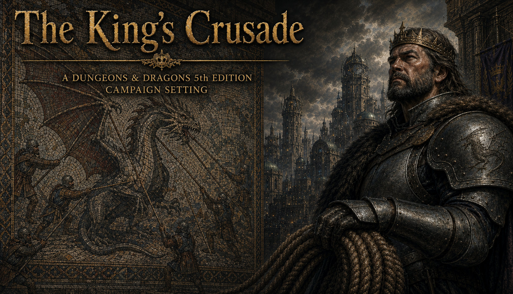

<p align="center">
  
</p>

# The King's Crusade

A Dungeons & Dragons 5th Edition campaign, high fantasy and traditionally D&D, built on a
loose Third Crusade spine. **Elduvaine** is the Living Realm, where magic is resident rather
than worked: roads shorten for travellers who mean well by whoever waits at the far end,
rivers keep what was said on their banks and give it back in the speaker's own voice, woods
hold the season they were planted in. Three years ago **Maedoc Vale**, Keeper of the Ysolde
Archive, opened every ward he had spent his life maintaining and let an army through them.
The kingdom fell to a key, not a siege.

**Xavier III of Harrowmark** has called a crusade and is leading it in person. The player
characters are the champions he sends ahead of the army — down a road long enough to change
them before they ever reach the kingdom at the end of it.

Every realm in the war is a mixed country. Harrowmark's wyvern-watch is dwarves on the pikes
and orcs on the ropes; Elduvaine is elves, gnomes and halflings living politely beside a
landscape that eavesdrops, with dryads in the older woods; and the army occupying it is a
hired hobgoblin legion that issues permits and files correct paperwork about terrible things.
A fourth realm never took the call at all, and has been buying the drained kingdom by the
cartload for three years.

> *A strange and marvellous kingdom worth saving, and a long dangerous road to reach it.*

This repository is the source of truth for the campaign.

## Contents

- [The documents](#the-documents) — [Sourcebook](#sourcebook) · [Core volumes](#core-volumes) · [Session modules](#session-modules) · [Guides](#guides)
- [How this repository works](#how-this-repository-works)
- [Table specifications](#table-specifications)
- [Rebuilding](#rebuilding)
- [Start here](#start-here)

## The documents

Eighteen documents, all generated. Read the Markdown on any device; the PDF is the styled,
font-embedded edition meant for the table.

### Sourcebook

- **[The King's Crusade — Sourcebook](corpus/KC_Sourcebook.md)** — setting canon: the call,
  Elduvaine before the fall, the fall, the occupation, the crusade and its Promise, and the
  guidance for running the Living Realm · [PDF](documents/KC_Sourcebook.pdf)

### Core volumes

- **[Gazetteer](corpus/KC_Gazetteer.md)** — the geography of the crusade: Harrowmark, both
  roads, and Elduvaine region by region, with roughly thirty keyed places, travel times
  between every leg of the march, and regional encounter tables · [PDF](documents/KC_Gazetteer.pdf)
- **[Bestiary](corpus/KC_Bestiary.md)** — what resident magic produces and what happens to it
  when the land is drained; the Sixth Free Legion as an institution with a contract; and stat
  blocks for the people worth statting. Every block calibrated against real SRD creatures at
  the same CR, never against the DMG table · [PDF](documents/KC_Bestiary.pdf)
- **[Character Options](corpus/KC_Character_Options.md)** — seven backgrounds, six feats,
  three subclasses, six spells and the wonders of Elduvaine as magic items. Player-facing,
  and none of it required · [PDF](documents/KC_Character_Options.pdf)

### Session modules

Eleven session slots across twelve files — Module Two forks by road, and only one half is
played at a given table. Each carries a pacing budget, a *What Is Actually Happening
(DM Only)* section, numbered scenes with boxed read-aloud, tiered skill DCs, SRD stat
blocks, NPC profiles, Optional Content, *Diverging Paths (DM Only)*, loot, and the Refrain.

Every module also carries **Puzzles and Set Pieces** — a puzzle with several real solutions
and none of them preferred, and a set piece run in phases rather than described. Sennoch
Hall and Vindana's undercity are keyed as dungeons.

| # | Title | Markdown | Document |
|---|---|---|---|
| 1 | The Muster | [md](corpus/KC_Module01_TheMuster.md) | [PDF](documents/KC_Module01_TheMuster.pdf) |
| 2A | The Sea Road | [md](corpus/KC_Module02A_TheSeaRoad.md) | [PDF](documents/KC_Module02A_TheSeaRoad.pdf) |
| 2B | The Mountain Road | [md](corpus/KC_Module02B_TheMountainRoad.md) | [PDF](documents/KC_Module02B_TheMountainRoad.pdf) |
| 3 | Landfall | [md](corpus/KC_Module03_Landfall.md) | [PDF](documents/KC_Module03_Landfall.pdf) |
| 4 | The Coalition | [md](corpus/KC_Module04_TheCoalition.md) | [PDF](documents/KC_Module04_TheCoalition.pdf) |
| 5 | The Road to Vindana | [md](corpus/KC_Module05_TheRoadToVindana.md) | [PDF](documents/KC_Module05_TheRoadToVindana.pdf) |
| 6 | The Siege of Vindana: Investment | [md](corpus/KC_Module06_VindanaInvestment.md) | [PDF](documents/KC_Module06_VindanaInvestment.pdf) |
| 7 | The Siege of Vindana: The Breaking | [md](corpus/KC_Module07_VindanaBreaking.md) | [PDF](documents/KC_Module07_VindanaBreaking.pdf) |
| 8 | Held Ground | [md](corpus/KC_Module08_HeldGround.md) | [PDF](documents/KC_Module08_HeldGround.pdf) |
| 9 | The Field Battle | [md](corpus/KC_Module09_TheFieldBattle.md) | [PDF](documents/KC_Module09_TheFieldBattle.pdf) |
| 10 | The Approach | [md](corpus/KC_Module10_TheApproach.md) | [PDF](documents/KC_Module10_TheApproach.pdf) |
| 11 | The Decision at the Gates | [md](corpus/KC_Module11_TheDecisionAtTheGates.md) | [PDF](documents/KC_Module11_TheDecisionAtTheGates.pdf) |

### Guides

- **[DM Reference Guide](corpus/KC_DM_Reference_Guide.md)** — single-column: Campaign at a
  Glance, the Stat Block Index, faith and factions, recurring NPCs, a puzzle index naming
  what solves each one, and the Branch Ledger with a blank column for what actually happened
  at your table · [PDF](documents/KC_DM_Reference_Guide.pdf)
- **[Player Guide](corpus/KC_Player_Guide.md)** — the sanitized, shareable edition. Authored
  as its own document rather than by trimming the sourcebook, so nothing a player should
  discover at the table is in it · [PDF](documents/KC_Player_Guide.pdf)

## How this repository works

The **generator scripts are the canon.** Everything else is input to them or output from
them — with one exception, `images/`. To change the campaign, edit a script in `scripts/`
and run `tools/build.sh`; never edit the generated files directly, because the next build
discards those edits.

| Directory | What it is |
|---|---|
| `scripts/` | **The canon.** docx-js generators, `transplant.py`, and the encoded visual template. |
| `corpus/` | **Generated Markdown** — readable and greppable on any device. Start here. |
| `documents/` | **Generated PDF** — styled, embeds its fonts, reads on any device. |
| `tools/` | `build.sh` regenerates and verifies everything; `docx-md-shim/` emits the Markdown; `normalize_pdf.py` makes the PDF reproducible. |
| `reference/` | Mirrored instructions — `project-instructions.md` mirrors `CLAUDE.md`; update both together. |
| `drafts/` | Design drafts. `*.RESOLVED.md` have been signed off and folded into canon; the rest are proposals. **Not canon.** |
| `images/` | Artwork, named for what it depicts. **Input to the build** — generators place it with `IMG()`. Holds the README title banner; no document carries an illustration yet. |

`corpus/` and `documents/` are produced from the same untouched scripts in the same build,
so the Markdown and the published documents cannot drift apart.

## Table specifications

| | |
|---|---|
| **Ruleset** | D&D 5e, **2014 rules (SRD 5.1)**. A deliberate choice, not a default — do not migrate this campaign to the 2024 rules. |
| **Party** | 4–6 players |
| **Starting level** | 5th — the party are the king's chosen champions, not raw levies |
| **Session length** | Five hours |
| **Advancement** | Milestone |

Every stat block is drawn unaltered from the SRD and named for the campaign; the Stat Block
Index in the DM Reference Guide records which SRD creature each one is built from, alongside
the creatures called for by reference — kobolds under Vindana, a troll in the Held Winter, a
dryad who is the wood — and the four Elduvish wonders. Every
combat carries adjusted-XP scaling for parties of four, five and six, checked against the
DMG thresholds at all three sizes rather than only at the endpoints.

## Rebuilding

```bash
npm install docx                                    # generator dependency
apt-get install -y libreoffice-writer ghostscript poppler-utils
#            ^ libreoffice-writer, NOT libreoffice-core: core alone loads nothing and
#              every document fails with "source file could not be loaded".
# Alegreya SC, Alegreya Sans SC, Lato -> ~/.local/share/fonts && fc-cache -f
#   fonts.google.com/download may be blocked; the static TTFs are at
#   raw.githubusercontent.com/google/fonts/main/ofl/{alegreyasc,alegreyasanssc,lato}/
tools/build.sh
```

`build.sh` regenerates both outputs, applies the visual template, renders every document to
a reproducible PDF, and **fails the build** on escape-sequence leaks, font substitution, a
literal typographic character in any generator source, or a missing LibreOffice Writer
module — the errors that are invisible in source or that masquerade as content bugs.

The PDFs are byte-reproducible **within one toolchain**: an unchanged document rebuilds to
an identical file. LibreOffice and Ghostscript version differences change the byte stream
without changing the document, so compare `pdftotext -layout` output before assuming a
content bug.

## Start here

Read [`CLAUDE.md`](CLAUDE.md) — it carries the premise, the tone, what is canon, what is
**deliberately** undecided, and the production practice. The distinction it draws between
those last two is load-bearing: some questions are gaps waiting to be filled, and others are
finished as they stand and must not be helpfully closed.

Then [`drafts/NEW-CAMPAIGN-HANDOFF.md`](drafts/NEW-CAMPAIGN-HANDOFF.md), which carries the
method and the environment gotchas from the first campaign built on this pipeline
([The Qilvayas Symphony](https://github.com/RettifiloAscari/The-Qilvayas-Symphony)).
